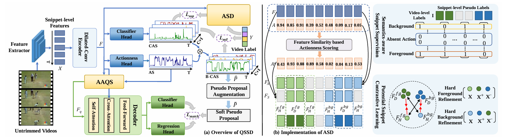

## Introduction
Pytorch implementation of paper:
Action-aware Query Selection and Ambiguous Snippet Disambiguation for Weakly-supervised Temporal Action Localization

The code is modified from [DiGiT](https://github.com/Dotori-HJ/DiGIT)

## Installation
#### NMS
```bash
cd util
python setup.py install --user # build NMS
cd ..
```

#### Temporal Deformable Attention
```bash
cd models/qssd/ops
python setup.py build install
cd ../../..
```

## Prepare Dataset
We follow [DiGiT](https://github.com/Dotori-HJ/DiGIT) to prepare all features and annotations.


## Evaluation
We provide the checkpoints [checkpoint](https://drive.google.com/file/d/1-Kmcl56_OHcn6eMZjwuXVQszT8Rz4WGs/view?usp=drive_link) and [thumos14_gen](https://drive.google.com/file/d/19-OaAwZ6VgoUElaE5qm8DqJvllvRP8LX/view?usp=drive_link) obtained from the first-stage training, which need to be placed in ```logs\thumos14```.
We provide the post-processed soft pseudo proposals in the ```data\thumos14\thumos14_soft_pseudo.json```. Simply run the following command to get the performance results:
```bash
python main.py --weakly False --eval False
```

We provide the checkpoints [thumos14_reg](https://drive.google.com/file/d/1oirYSgsQWnvdTWF4ub4pkTb6RGQsj30K/view?usp=drive_link) obtained from the second-stage training, which need to be placed in ```logs\thumos14```. Simply run the following command to get the performance results:
```bash
python main.py --weakly False --eval True
```


## Training
To train from scratch, you can execute the following code sequentially:
```bash
python main.py --weakly True --eval False
```
```bash
python postprocess.py
```
```bash
python main.py --weakly False --eval False
```
Note that you need to modify the ground-truth path in the config.
